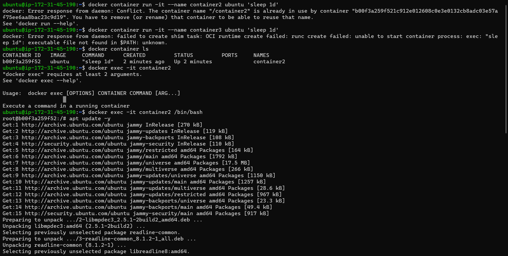

Create an alpine container in interactive mode and install python
------------------------------------------------------

* Launch an Ec2 instance.
* Install docker by using below steps.
  
### steps
```
curl -fsSL https://get.docker.com -o get-docker.sh
sh get-docker.sh
sudo usermod -aG docker <username>
#exit and relogin
docker info
```
* Create container by using the below command ``docker container -it --name container1 alpine /bin/sh``
* List out the container ``docker container ls``
* Logon into the container ``docker exec -it container1 /bin/sh``
* Install python3 ``apk update && apk add python3 && python3 --version``


Create an ubuntu container with sleep 1d and the login using exec. Install python.
-------------------------------------------------------

* Launch an Ec2 instance.
* Install docker by using below steps.
  
### steps
```
curl -fsSL https://get.docker.com -o get-docker.sh
sh get-docker.sh
sudo usermod -aG docker <username>
#exit and relogin
docker info
```
* Create container by using the below command ``docker container -it --name container2 ubuntu /bin/bash``
* List out the container ``docker container ls``
* Logon into the container ``docker exec -it container2 /bin/bash``
* Install python3 ``apt update && apt install python3 && python3 --version``



Create a postgress container with user panoramic and password trekking. Try logging in and show the  database
-----------------------------------------------------

* Launch an Ec2 instance.
* Install docker by using below steps.
  
### steps
```
curl -fsSL https://get.docker.com -o get-docker.sh
sh get-docker.sh
sudo usermod -aG docker <username>
#exit and relogin
docker info
```
To create a container 

`` docker container run -d --name psqldb  -P  -e POSTGRES_DB=employees -e POSTGRES_USER=panoromic -e POSTGRES_PASSWORD=trekking postgres``

Login to the container with the databse above mentioned "employees"
 ``psql -U panoromic --password -d employees``

Crate table in the employees database

``CREATE TABLE Persons`` ( PersonID int, LastName varchar(255), FirstName varchar(255) );``

Insert the values into the table

`` Insert into Persons values (1 , 'Gattu' , 'shravani');``

To see the data

``Select * from Persons;``


Creating docker file which runs on Php page on apache server
-------------------------------------------------------
* Launch an Ec2 instance.
* Install docker by using below steps.
  
### steps
```
curl -fsSL https://get.docker.com -o get-docker.sh
sh get-docker.sh
sudo usermod -aG docker <username>
#exit and relogin
docker info
```
To create image 
 ``docker build -t php:v3.0 .``
To create a container 
 ``docker container run --name contaninerphp -d -p 30700:80 php:v3.0``

Create file with the below content

``<?php
 phpinfo()
?>``

# Dockerfile
```docker
FROM ubuntu
RUN apt update && apt install apache2 -y
ARG DEBIAN_FRONTEND=noninteractive
RUN apt install php -y
RUN apt install libapache2-mod-php -y
WORKDIR /var/www/html
COPY /php.file /var/www/html/info.php
EXPOSE 80
CMD ["apache2ctl", "-D", "FOREGROUND"]
```


Docker file for jenkins
------------------------

* Launch an Ec2 instance.
* Install docker by using below steps.
  
### steps
```
curl -fsSL https://get.docker.com -o get-docker.sh
sh get-docker.sh
sudo usermod -aG docker <username>
#exit and relogin
docker info
```


```docker
FROM ubuntu
RUN apt update && apt install openjdk-11-jdk -y && apt install curl -y
RUN curl -fsSL https://pkg.jenkins.io/debian/jenkins.io-2023.key | tee \
  /usr/share/keyrings/jenkins-keyring.asc > /dev/null
RUN echo deb [signed-by=/usr/share/keyrings/jenkins-keyring.asc] \
  https://pkg.jenkins.io/debian binary/ |  tee \
  /etc/apt/sources.list.d/jenkins.list > /dev/null
RUN apt update
RUN apt install jenkins -y
CMD /usr/bin/jenkins
USER jenkins
EXPOSE 8080
```

To create image 
 ``docker build -t jenkins:v7.0 .``
To create a container 
 ``docker container run --name cont34 -d -P jenkins:v7.0``

After cfreating the container enter inside the container by using ``docker exec -it cont34 /bin/sh`` 
enter ``cat /var/lib/jenkins/.jenkins/secrets/initialAdminPassword.`` It will display the passwrd.Enter the password and login in the jenkins page.


Create mysql and nopcmmerce containers and try to make them work by configuring.
----------------------------------------------------------------------------------
```docker
FROM mcr.microsoft.com/dotnet/sdk:7.0
LABEL author="shravani" organization="sr" project="learning"
ADD https://github.com/nopSolutions/nopCommerce/releases/download/release-4.60.2/nopCommerce_4.60.2_NoSource_linux_x64.zip /nop/nopCommerce_4.60.2_NoSource_linux_x64.zip
WORKDIR /nop
RUN apt update && apt install unzip -y && \
    unzip /nop/nopCommerce_4.60.2_NoSource_linux_x64.zip && \
    mkdir /nop/bin && mkdir /nop/logs
EXPOSE 5000
CMD [ "dotnet", "Nop.Web.dll","--urls", "http://0.0.0.0:5000" ]
```

* Launch an Ec2 instance.
* Install docker by using below steps.
  
### steps
```
curl -fsSL https://get.docker.com -o get-docker.sh
sh get-docker.sh

sudo usermod -aG docker <username>
#exit and relogin
docker info
```

``docker image build -t nop:latest``

``docker network create -d bridge nop_bridge``
``docker volume create nop_db``

``docker container run -d --name mysql -e MYSQL_ROOT_PASSWORD=shravani@143 -e MYSQL_DATABASE=employees -e MYSQL_USER=shravani -e MYSQL_PASSWORD=shravani@143 --network nop_bridge -v nop_db:/var/lib/mysql mysql:5.6``

``docker container run -d -P --name nopcommerce -e MYSQL_SERVER=mysql --network nop_bridge nop:latest``


we need to start the container again by using ``docker container start nopcommerce``


Creating docker file which runs on Php page on apache server
------------------------------------------------------------

* Launch an Ec2 instance.
* Install docker by using below steps.
  
### steps
```
curl -fsSL https://get.docker.com -o get-docker.sh
sh get-docker.sh
sudo usermod -aG docker <username>
#exit and relogin
docker info
```


```docker
FROM ubuntu
RUN apt update && apt install nginx -y
ARG DEBIAN_FRONTEND=noninteractive
RUN apt install php-fpm -y
RUN mkdir /var/www/html
RUN chown -R $root:$root /var/www/html
COPY /sites /etc/nginx/sites-available/html
RUN ln -s /etc/nginx/sites-available/html /etc/nginx/sites-enabled/
RUN unlink /etc/nginx/sites-enabled/default
RUN nginx -t
RUN service nginx reload
COPY /php.file /var/www/html/index.html
COPY /php /var/www/html/info.php
EXPOSE 80
CMD ["nginx", "-g", "daemon off;"]
```
```
php
<?php
 phpinfo()
?>
```
```
Sites

server {
    listen 80;
    server_name html www.html;
    root /var/www/html;

    index index.html index.htm index.php;

    location / {
        try_files $uri $uri/ =404;
    }

    location ~ \.php$ {
        include snippets/fastcgi-php.conf;
        fastcgi_pass unix:/var/run/php/php7.4-fpm.sock;
     }

    location ~ /\.ht {
        deny all;
    }

}
```
```
php.file

<html>
  <head>
    <title>html website</title>
  </head>
  <body>
    <h1>Hello World!</h1>

    <p>This is the landing page of <strong>html</strong>.</p>
  </body>
</html>
```

To create image 
 ``docker build -t ngn:1.0 .``
To create a container 
 ``docker container run --name contaninerphp -d -p 30700:80 ngn:1.0``
 


# TASK2

Create multistage docker file for springpet clinic
---------------------------------------------------

* Launch an Ec2 instance.
* Install docker by using below steps.
  
### steps
```
curl -fsSL https://get.docker.com -o get-docker.sh
sh get-docker.sh
sudo usermod -aG docker <username>
#exit and relogin
docker info
```

```docker
FROM alpine/git AS vcs
RUN cd / && git clone https://github.com/spring-projects/spring-petclinic.git && \
    pwd && ls /spring-petclinic

FROM maven:3-amazoncorretto-17 AS builder
COPY --from=vcs /spring-petclinic /spring-petclinic
RUN ls /spring-petclinic 
RUN cd /spring-petclinic && mvn package

FROM amazoncorretto:17-alpine-jdk
WORKDIR /spc
COPY --from=builder /spring-petclinic/target/spring-petclinic-*.jar /spc/spring-petclinic
EXPOSE 8080
CMD ["java" , "-jar" , "springpetclinic-*.jar"]
```
To create image 
 ``docker build -t spc:1.0 .``
 
 
To create a container 
 ``docker container run --name contaniner1 -d -P spc:1.0``


Create multistage docker file for nopcommerce
----------------------------------------------
* Launch an Ec2 instance.
* Install docker by using below steps.
  
### steps
```
curl -fsSL https://get.docker.com -o get-docker.sh
sh get-docker.sh
sudo usermod -aG docker <username>
#exit and relogin
docker info
```
```docker
FROM ubuntu:22.04 As builder
RUN apt update && apt install unzip -y
ADD https://github.com/nopSolutions/nopCommerce/releases/download/release-4.40.2/nopCommerce_4.40.2_NoSource_linux_x64.zip /nop/nopCommerce_4.40.2_NoSource_linux_x64.zip
RUN cd nop && unzip nopCommerce_4.40.2_NoSource_linux_x64.zip && rm nopCommerce_4.40.2_NoSource_linux_x64.zip


FROM mcr.microsoft.com/dotnet/sdk:7.0
LABEL author="shravani" organization="qt" project="learning"
COPY --from=builder /nop /nop-bin
WORKDIR /nop-bin
EXPOSE 5000
CMD [ "dotnet", "Nop.Web.dll", "--urls", "http://0.0.0.0:5000" ]
```
To create image 
 ``docker build -t nop:1.0 .``

To create a container 
 ``docker container run --name contaniner1 -d -P nop:1.0``
 

Create multistage docker file for studentscourse register
-------------------------------------------------


* Launch an Ec2 instance.
* Install docker by using below steps.
  
### steps
```
curl -fsSL https://get.docker.com -o get-docker.sh
sh get-docker.sh
sudo usermod -aG docker <username>
#exit and relogin
docker info
```
```docker
FROM alpine/git AS vcs
RUN cd / && git clone https://github.com/DevProjectsForDevOps/StudentCoursesRestAPI.git && \
pwd && ls /StudentCoursesRestAPI
FROM python:3.8.3-alpine As Builder
LABEL author="shravani" organization="qt" project="learning"
COPY --from=vcs /StudentCoursesRestAPI /StudentCoursesRestAPI
ARG DIRECTORY=StudentCourses
RUN cd / StudentCoursesRestAPI cp requirements.txt /StudentCourses
ADD . ${DIRECTORY}
EXPOSE 8080
WORKDIR StudentCoursesRestAPI
RUN pip install --upgrade pip
RUN pip install -r requirements.txt
ENTRYPOINT ["python", "app.py"]
```


Push the nopcommerce image to aws ECR
-----------------------------------------
* Launch an Ec2 instance.
* Install docker by using below steps.
  
### steps
```
curl -fsSL https://get.docker.com -o get-docker.sh
sh get-docker.sh
sudo usermod -aG docker <username>
#exit and relogin
docker info
```

* Create an ECR Repository name(nopcommerce)
* configure the awscli in the instance

  Use below commands to push the image into ECR:
``aws ecr-public get-login-password --region us-east-1 | docker login --username AWS --password-stdin public.ecr.aws/u8d0a2g1``
``docker build -t nopcommerce .``
``docker tag nopcommerce:latest public.ecr.aws/u8d0a2g1/nopcommerce:latest``
``docker push public.ecr.aws/u8d0a2g1/nopcommerce:latest``


Push the springpetclinic image to aws ECR
-----------------------------------------
* Launch an Ec2 instance.
* Install docker by using below steps.
  
### steps
```
curl -fsSL https://get.docker.com -o get-docker.sh
sh get-docker.sh
sudo usermod -aG docker <username>
#exit and relogin
docker info
```

* Create an ECR Repository name(springpetclinic)
* configure the awscli in the instance
  Use below commands to push the image into ECR:

``aws ecr-public get-login-password --region us-east-1 | docker login --username AWS --password-stdin public.ecr.aws/u8d0a2g1``
``docker build -t springpetclinic .``
``docker tag springpetclinic:latest public.ecr.aws/u8d0a2g1/springpetclinic:latest``
``docker push public.ecr.aws/u8d0a2g1/springpetclinic:latest``


Push the studentregister image to aws ECR
-----------------------------------------
* Launch an Ec2 instance.
* Install docker by using below steps.
  
### steps
```
curl -fsSL https://get.docker.com -o get-docker.sh
sh get-docker.sh
sudo usermod -aG docker <username>
#exit and relogin
docker info
```

* Create an ECR Repository name(student register)
* configure the awscli in the instance

  Use below commands to push the image into ECR:

``aws ecr-public get-login-password --region us-east-1 | docker login --username AWS --password-stdin public.ecr.aws/u8d0a2g1``
``docker build -t studentregister .``
``docker tag studentregister:latest public.ecr.aws/u8d0a2g1/studentregister:latest``
``docker push public.ecr.aws/u8d0a2g1/studentregister:latest``


Docker Compose for student register
------------------------------------

```yaml
---
version: "3.9"
services:
  studentcourse :
    build :
      context: .
      dockerfile: Dockerfile
    ports:
         - "30000:8080"
    image: scr 
```
To run the compose file ``docker compose up -d``


Docker Compose for nopcommerce
------------------------------
```yaml
---
version: "3.9"
services:
  nop:
   build:
     context: .
   ports:
     - "35001:5000"
   depends_on:
     - nop_db
  nop_db:
    image: mysql:8
    volumes:
      - nop_db:/var/lib/mysql
    environment:
      - MYSQL_ROOT_PASSWORD=shravani@143
      - MYSQL_DATABASE=employees
      - MYSQL_USER=shravani
      - MYSQL_PASSWORD=shravani@143
    networks: 
      - nop_bridge
volumes:
  nop_db:
networks:
  nop_bridge:
```
To run the compose file ``docker compose up -d``
 


Docker compose file for spc
---------------------------
```yaml
---
version: "3.9"
services:
  springpet :
    build :
      context: .
      dockerfile: Dockerfile
    image: spc
  springboot:
    image: spc:3.0.0
    container_name: springboot
    networks:
      - spring-net
    volumes:
      - spring-db:/var/lib/mysql
    ports:
      - "8080:8080"
volumes:
   spring-db:
networks:
   spring-net:
```
To run the compose file ``docker compose up -d``


Docker compose file for game-of-life
------------------------------------
```docker
FROM alpine/git AS vcs
RUN cd / && git clone https://github.com/wakaleo/game-of-life.git
FROM maven:3-amazoncorretto-8 AS builder
COPY --from=vcs /game-of-life /game-of-life
RUN cd /game-of-life && mvn package
FROM tomcat:9-jdk8
LABEL author="khaja" organization="qt"
COPY --from=builder /game-of-life/gameoflife-web/target/*.war /usr/local/tomcat/webapps/gameoflife.war
EXPOSE 8080
```

```yaml
---
version: "3.9"
services:
  gameoflife:
    build:
      context: .
    ports:
      - "30000:8080"
```

To run the compose file ``docker compose up -d``


TASK 26-04-2023
----------------

Write a Pod Spec for Spring PetClinic and nopCommerce Applications and execute the kubectl commands:
   kubectl get pods and describe pods
-------------------------------------------------------


Manifest.yaml for spring pet clinic.
```yaml
---
apiVersion: v1
kind: Pod
metadata:
  name: spc
spec:
  containers:
    - name: springpetclinic
      image: lakshminarayana1849/springpetclinic 
      ports:
        - containerPort: 8080
```
Login to the master node and paste the manifest.yaml file in the master node. ``vi manifest.yaml``
``kubectl apply -f manifest.yaml``
``kebectl get po -o wide``
``kebectl describe po``


Manifest1.yaml for nop commerce.

```yaml
---
apiVersion: v1
kind: Pod
metadata:
  name: nop
spec:
  containers:
    - name: nopcommerce
      image:  raji07/rajeshwari-nopcommerce
      ports:
        - containerPort: 8080
```

Login to the master node and paste the manifest1.yaml file in the master node. ``vi manifest1.yaml``
``kubectl apply -f manifest1.yaml``
``kebectl get po -o wide``
``kebectl describe po``


