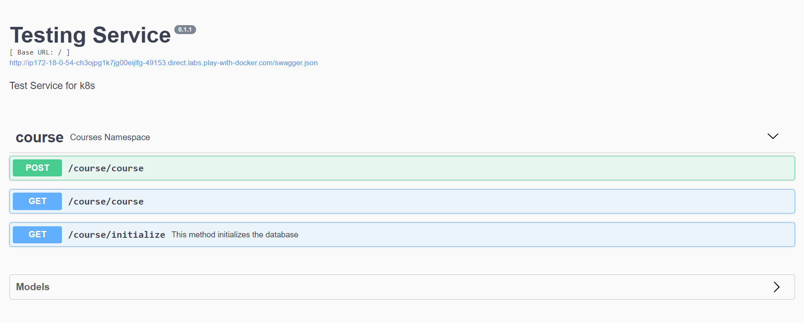

Create an alpine container in interactive mode and install python
------------------------------------------------------

* Launch an Ec2 instance.
* Install docker by using below steps.
  
### steps
```
curl -fsSL https://get.docker.com -o get-docker.sh
sh get-docker.sh
sudo usermod -aG docker <username>
#exit and relogin
docker info
```
* Create container by using the below command ``docker container -it --name container1 alpine /bin/sh``
* List out the container ``docker container ls``
* Logon into the container ``docker exec -it container1 /bin/sh``
* Install python3 ``apk update && apk add python3 && python3 --version``


Create an ubuntu container with sleep 1d and the login using exec. Install python.
-------------------------------------------------------

* Launch an Ec2 instance.
* Install docker by using below steps.
  
### steps
```
curl -fsSL https://get.docker.com -o get-docker.sh
sh get-docker.sh
sudo usermod -aG docker <username>
#exit and relogin
docker info
```
* Create container by using the below command ``docker container -it --name container2 ubuntu /bin/bash``
* List out the container ``docker container ls``
* Logon into the container ``docker exec -it container2 /bin/bash``
* Install python3 ``apt update && apt install python3 && python3 --version``


Create a postgress container with user panoramic and password trekking. Try logging in and show the  database
-----------------------------------------------------

* Launch an Ec2 instance.
* Install docker by using below steps.
  
### steps
```
curl -fsSL https://get.docker.com -o get-docker.sh
sh get-docker.sh
sudo usermod -aG docker <username>
#exit and relogin
docker info
```
To create a container 

`` docker container run -d --name psqldb  -P  -e POSTGRES_DB=employees -e POSTGRES_USER=panoromic -e POSTGRES_PASSWORD=trekking postgres``

Login to the container with the databse above mentioned "employees"
 ``psql -U panoromic --password -d employees``

Crate table in the employees database

``CREATE TABLE Persons`` ( PersonID int, LastName varchar(255), FirstName varchar(255) );``

Insert the values into the table

`` Insert into Persons values (1 , 'Gattu' , 'shravani');``

To see the data

``Select * from Persons;``


Creating docker file which runs on Php page on apache server
-------------------------------------------------------
* Launch an Ec2 instance.
* Install docker by using below steps.
  
### steps
```
curl -fsSL https://get.docker.com -o get-docker.sh
sh get-docker.sh
sudo usermod -aG docker <username>
#exit and relogin
docker info
```
To create image 
 ``docker build -t php:v3.0 .``
To create a container 
 ``docker container run --name contaninerphp -d -p 30700:80 php:v3.0``

Create file with the below content

``<?php
 phpinfo()
?>``

# Dockerfile
```docker
FROM ubuntu
RUN apt update && apt install apache2 -y
ARG DEBIAN_FRONTEND=noninteractive
RUN apt install php -y
RUN apt install libapache2-mod-php -y
WORKDIR /var/www/html
COPY /php.file /var/www/html/info.php
EXPOSE 80
CMD ["apache2ctl", "-D", "FOREGROUND"]
```


Docker file for jenkins
------------------------

* Launch an Ec2 instance.
* Install docker by using below steps.
  
### steps
```
curl -fsSL https://get.docker.com -o get-docker.sh
sh get-docker.sh
sudo usermod -aG docker <username>
#exit and relogin
docker info
```


```docker
FROM ubuntu
RUN apt update && apt install openjdk-11-jdk -y && apt install curl -y
RUN curl -fsSL https://pkg.jenkins.io/debian/jenkins.io-2023.key | tee \
  /usr/share/keyrings/jenkins-keyring.asc > /dev/null
RUN echo deb [signed-by=/usr/share/keyrings/jenkins-keyring.asc] \
  https://pkg.jenkins.io/debian binary/ |  tee \
  /etc/apt/sources.list.d/jenkins.list > /dev/null
RUN apt update
RUN apt install jenkins -y
CMD /usr/bin/jenkins
USER jenkins
EXPOSE 8080
```

To create image 
 ``docker build -t jenkins:v7.0 .``
To create a container 
 ``docker container run --name cont34 -d -P jenkins:v7.0``

After cfreating the container enter inside the container by using ``docker exec -it cont34 /bin/sh`` 
enter ``cat /var/lib/jenkins/.jenkins/secrets/initialAdminPassword.`` It will display the passwrd.Enter the password and login in the jenkins page.


Create mysql and nopcmmerce containers and try to make them work by configuring.
----------------------------------------------------------------------------------
```docker
FROM mcr.microsoft.com/dotnet/sdk:7.0
LABEL author="shravani" organization="sr" project="learning"
ADD https://github.com/nopSolutions/nopCommerce/releases/download/release-4.60.2/nopCommerce_4.60.2_NoSource_linux_x64.zip /nop/nopCommerce_4.60.2_NoSource_linux_x64.zip
WORKDIR /nop
RUN apt update && apt install unzip -y && \
    unzip /nop/nopCommerce_4.60.2_NoSource_linux_x64.zip && \
    mkdir /nop/bin && mkdir /nop/logs
EXPOSE 5000
CMD [ "dotnet", "Nop.Web.dll","--urls", "http://0.0.0.0:5000" ]
```

* Launch an Ec2 instance.
* Install docker by using below steps.
  
### steps
```
curl -fsSL https://get.docker.com -o get-docker.sh
sh get-docker.sh

sudo usermod -aG docker <username>
#exit and relogin
docker info
```

``docker image build -t nop:latest``

``docker network create -d bridge nop_bridge``
``docker volume create nop_db``

``docker container run -d --name mysql -e MYSQL_ROOT_PASSWORD=shravani@143 -e MYSQL_DATABASE=employees -e MYSQL_USER=shravani -e MYSQL_PASSWORD=shravani@143 --network nop_bridge -v nop_db:/var/lib/mysql mysql:5.6``

``docker container run -d -P --name nopcommerce -e MYSQL_SERVER=mysql --network nop_bridge nop:latest``


we need to start the container again by using ``docker container start nopcommerce``


Creating docker file which runs on Php page on apache server
------------------------------------------------------------

* Launch an Ec2 instance.
* Install docker by using below steps.
  
### steps
```
curl -fsSL https://get.docker.com -o get-docker.sh
sh get-docker.sh
sudo usermod -aG docker <username>
#exit and relogin
docker info
```


```docker
FROM ubuntu
RUN apt update && apt install nginx -y
ARG DEBIAN_FRONTEND=noninteractive
RUN apt install php-fpm -y
RUN mkdir /var/www/html
RUN chown -R $root:$root /var/www/html
COPY /sites /etc/nginx/sites-available/html
RUN ln -s /etc/nginx/sites-available/html /etc/nginx/sites-enabled/
RUN unlink /etc/nginx/sites-enabled/default
RUN nginx -t
RUN service nginx reload
COPY /php.file /var/www/html/index.html
COPY /php /var/www/html/info.php
EXPOSE 80
CMD ["nginx", "-g", "daemon off;"]
```
```
php
<?php
 phpinfo()
?>
```
```
Sites

server {
    listen 80;
    server_name html www.html;
    root /var/www/html;

    index index.html index.htm index.php;

    location / {
        try_files $uri $uri/ =404;
    }

    location ~ \.php$ {
        include snippets/fastcgi-php.conf;
        fastcgi_pass unix:/var/run/php/php7.4-fpm.sock;
     }

    location ~ /\.ht {
        deny all;
    }

}
```
```
php.file

<html>
  <head>
    <title>html website</title>
  </head>
  <body>
    <h1>Hello World!</h1>

    <p>This is the landing page of <strong>html</strong>.</p>
  </body>
</html>
```

To create image 
 ``docker build -t ngn:1.0 .``
To create a container 
 ``docker container run --name contaninerphp -d -p 30700:80 ngn:1.0``
 


# TASK2

Create multistage docker file for springpet clinic
---------------------------------------------------

* Launch an Ec2 instance.
* Install docker by using below steps.
  
### steps
```
curl -fsSL https://get.docker.com -o get-docker.sh
sh get-docker.sh
sudo usermod -aG docker <username>
#exit and relogin
docker info
```

```docker
FROM alpine/git AS vcs
RUN cd / && git clone https://github.com/spring-projects/spring-petclinic.git && \
    pwd && ls /spring-petclinic

FROM maven:3-amazoncorretto-17 AS builder
COPY --from=vcs /spring-petclinic /spring-petclinic
RUN ls /spring-petclinic 
RUN cd /spring-petclinic && mvn package

FROM amazoncorretto:17-alpine-jdk
WORKDIR /spc
COPY --from=builder /spring-petclinic/target/spring-petclinic-*.jar /spc/spring-petclinic
EXPOSE 8080
CMD ["java" , "-jar" , "springpetclinic-*.jar"]
```
To create image 
 ``docker build -t spc:1.0 .``
 
 
To create a container 
 ``docker container run --name contaniner1 -d -P spc:1.0``


Create multistage docker file for nopcommerce
----------------------------------------------
* Launch an Ec2 instance.
* Install docker by using below steps.
  
### steps
```
curl -fsSL https://get.docker.com -o get-docker.sh
sh get-docker.sh
sudo usermod -aG docker <username>
#exit and relogin
docker info
```
```docker
FROM ubuntu:22.04 As builder
RUN apt update && apt install unzip -y
ADD https://github.com/nopSolutions/nopCommerce/releases/download/release-4.40.2/nopCommerce_4.40.2_NoSource_linux_x64.zip /nop/nopCommerce_4.40.2_NoSource_linux_x64.zip
RUN cd nop && unzip nopCommerce_4.40.2_NoSource_linux_x64.zip && rm nopCommerce_4.40.2_NoSource_linux_x64.zip


FROM mcr.microsoft.com/dotnet/sdk:7.0
LABEL author="shravani" organization="qt" project="learning"
COPY --from=builder /nop /nop-bin
WORKDIR /nop-bin
EXPOSE 5000
CMD [ "dotnet", "Nop.Web.dll", "--urls", "http://0.0.0.0:5000" ]
```
To create image 
 ``docker build -t nop:1.0 .``

To create a container 
 ``docker container run --name contaniner1 -d -P nop:1.0``
 

Create multistage docker file for studentscourse register
-------------------------------------------------


* Launch an Ec2 instance.
* Install docker by using below steps.
  
### steps
```
curl -fsSL https://get.docker.com -o get-docker.sh
sh get-docker.sh
sudo usermod -aG docker <username>
#exit and relogin
docker info
```
```docker
FROM alpine/git AS vcs
RUN cd / && git clone https://github.com/DevProjectsForDevOps/StudentCoursesRestAPI.git && \
pwd && ls /StudentCoursesRestAPI
FROM python:3.8.3-alpine As Builder
LABEL author="shravani" organization="qt" project="learning"
COPY --from=vcs /StudentCoursesRestAPI /StudentCoursesRestAPI
ARG DIRECTORY=StudentCourses
RUN cd / StudentCoursesRestAPI cp requirements.txt /StudentCourses
ADD . ${DIRECTORY}
EXPOSE 8080
WORKDIR StudentCoursesRestAPI
RUN pip install --upgrade pip
RUN pip install -r requirements.txt
ENTRYPOINT ["python", "app.py"]
```



Push the nopcommerce image to aws ECR
-----------------------------------------
* Launch an Ec2 instance.
* Install docker by using below steps.
  
### steps
```
curl -fsSL https://get.docker.com -o get-docker.sh
sh get-docker.sh
sudo usermod -aG docker <username>
#exit and relogin
docker info
```

* Create an ECR Repository name(nopcommerce)
* configure the awscli in the instance

  Use below commands to push the image into ECR:
``aws ecr-public get-login-password --region us-east-1 | docker login --username AWS --password-stdin public.ecr.aws/u8d0a2g1``
``docker build -t nopcommerce .``
``docker tag nopcommerce:latest public.ecr.aws/u8d0a2g1/nopcommerce:latest``
``docker push public.ecr.aws/u8d0a2g1/nopcommerce:latest``


Push the springpetclinic image to aws ECR
-----------------------------------------
* Launch an Ec2 instance.
* Install docker by using below steps.
  
### steps
```
curl -fsSL https://get.docker.com -o get-docker.sh
sh get-docker.sh
sudo usermod -aG docker <username>
#exit and relogin
docker info
```

* Create an ECR Repository name(springpetclinic)
* configure the awscli in the instance
  Use below commands to push the image into ECR:

``aws ecr-public get-login-password --region us-east-1 | docker login --username AWS --password-stdin public.ecr.aws/u8d0a2g1``
``docker build -t springpetclinic .``
``docker tag springpetclinic:latest public.ecr.aws/u8d0a2g1/springpetclinic:latest``
``docker push public.ecr.aws/u8d0a2g1/springpetclinic:latest``


Push the studentregister image to aws ECR
-----------------------------------------
* Launch an Ec2 instance.
* Install docker by using below steps.
  
### steps
```
curl -fsSL https://get.docker.com -o get-docker.sh
sh get-docker.sh
sudo usermod -aG docker <username>
#exit and relogin
docker info
```

* Create an ECR Repository name(student register)
* configure the awscli in the instance

  Use below commands to push the image into ECR:

``aws ecr-public get-login-password --region us-east-1 | docker login --username AWS --password-stdin public.ecr.aws/u8d0a2g1``
``docker build -t studentregister .``
``docker tag studentregister:latest public.ecr.aws/u8d0a2g1/studentregister:latest``
``docker push public.ecr.aws/u8d0a2g1/studentregister:latest``


Docker Compose for student register
------------------------------------

```yaml
---
version: "3.9"
services:
  studentcourse :
    build :
      context: .
      dockerfile: Dockerfile
    ports:
         - "30000:8080"
    image: scr 
```
To run the compose file ``docker compose up -d``


Docker Compose for nopcommerce
------------------------------
```yaml
---
version: "3.9"
services:
  nop:
   build:
     context: .
   ports:
     - "35001:5000"
   depends_on:
     - nop_db
  nop_db:
    image: mysql:8
    volumes:
      - nop_db:/var/lib/mysql
    environment:
      - MYSQL_ROOT_PASSWORD=shravani@143
      - MYSQL_DATABASE=employees
      - MYSQL_USER=shravani
      - MYSQL_PASSWORD=shravani@143
    networks: 
      - nop_bridge
volumes:
  nop_db:
networks:
  nop_bridge:
```
To run the compose file ``docker compose up -d``
 


Docker compose file for spc
---------------------------
```yaml
---
version: "3.9"
services:
  springpet :
    build :
      context: .
      dockerfile: Dockerfile
    image: spc
  springboot:
    image: spc:3.0.0
    container_name: springboot
    networks:
      - spring-net
    volumes:
      - spring-db:/var/lib/mysql
    ports:
      - "8080:8080"
volumes:
   spring-db:
networks:
   spring-net:
```
To run the compose file ``docker compose up -d``


Docker compose file for game-of-life
------------------------------------
```docker
FROM alpine/git AS vcs
RUN cd / && git clone https://github.com/wakaleo/game-of-life.git
FROM maven:3-amazoncorretto-8 AS builder
COPY --from=vcs /game-of-life /game-of-life
RUN cd /game-of-life && mvn package
FROM tomcat:9-jdk8
LABEL author="khaja" organization="qt"
COPY --from=builder /game-of-life/gameoflife-web/target/*.war /usr/local/tomcat/webapps/gameoflife.war
EXPOSE 8080
```

```yaml
---
version: "3.9"
services:
  gameoflife:
    build:
      context: .
    ports:
      - "30000:8080"
```

To run the compose file ``docker compose up -d``


TASK 26-04-2023
----------------

Write a Pod Spec for Spring PetClinic and nopCommerce Applications and execute the kubectl commands:
   kubectl get pods and describe pods
-------------------------------------------------------


Manifest.yaml for spring pet clinic.
```yaml
---
apiVersion: v1
kind: Pod
metadata:
  name: spc
spec:
  containers:
    - name: springpetclinic
      image: lakshminarayana1849/springpetclinic 
      ports:
        - containerPort: 8080
```
Login to the master node and paste the manifest.yaml file in the master node. ``vi manifest.yaml``
``kubectl apply -f manifest.yaml``
``kebectl get po -o wide``
``kebectl describe po``


Manifest1.yaml for nop commerce.

```yaml
---
apiVersion: v1
kind: Pod
metadata:
  name: nop
spec:
  containers:
    - name: nopcommerce
      image:  raji07/rajeshwari-nopcommerce
      ports:
        - containerPort: 8080
```

Login to the master node and paste the manifest1.yaml file in the master node. ``vi manifest1.yaml``
``kubectl apply -f manifest1.yaml``
``kebectl get po -o wide``
``kebectl describe po``


TASK:27-04-2023
----------------
 Explain Kubernetes architecture:

 

* Kubernetes is an open-source platform that is widely used for container orchestration. It is designed to automate the deployment, scaling, and management of containerized applications. Kubernetes can be used to manage and run applications in a variety of environments, including public, private, and hybrid clouds.


Kubernetes components can be divided into two categories:
# Control Plane Components 
  * kube-apiserver:The Kubernetes API Server exposes the Kubernetes API, which is used by clients to interact with the Kubernetes cluster. It is responsible for validating and processing API requests.
    * etcd:etcd stores  the configuration data of the Kubernetes cluster in the form of key value pair.
    * kube-scheduler:The kube-scheduler is responsible for scheduling the pods on the nodes in the Kubernetes cluster.
    * kube-controller-manager:The kube-controller-manager runs controllers that are responsible for maintaining the desired state of the Kubernetes cluster.
    * cloud-controller-manager:The cloud-controller-manager is responsible for managing the cloud provider-specific resources in the Kubernetes cluster. 
# Worker Nodes Components.
* Nodes:Nodes are the worker machines that run the containers. They are managed by the Kubernetes master components.
* Pods:Pods are the smallest deployable units in the Kubernetes cluster. They contain one or more containers and are scheduled on nodes.
* kubelet:The Kubelet is the primary node agent that communicates with the Kubernetes API server and ensures that the containers are running on the node as expected. It is responsible for starting, stopping, and monitoring the containers on the node.
* kube-proxy:The kube-proxy is responsible for providing network connectivity to the pods running on the node. It does this by creating network rules that allow traffic to be forwarded to the pods.
* Container Runtime:The Container Runtime is the software that runs the containers on the node. Kubernetes supports several container runtimes, including Docker, CRI-O, and containerd.


# Installing minikube on Ubuntu:

* Launch an Ec2 instance.
* Install docker by using below steps.
  
### steps
```
curl -fsSL https://get.docker.com -o get-docker.sh
sh get-docker.sh
sudo usermod -aG docker <username>
#exit and relogin
docker info
```

Install minikube
``curl -LO https://storage.googleapis.com/minikube/releases/latest/minikube-linux-amd64``
``sudo install minikube-linux-amd64 /usr/local/bin/minikube``
``minikube start``

``Install kubectl sudo snap install kubectl --classic``

``vi manifest.yaml``
``kubectl get po -A``
``minikube dashboard`` "ctrl+c"
``alias kubectl="minikube kubectl --"``

```Yaml
---
apiVersion: v1
kind: Pod
metadata:
  name: spc
spec:
  containers:
    - name: springpetclinic
      image: lakshminarayana1849/springpetclinic 
      ports:
        - containerPort: 8080
```
``kubectl apply -f manifest1.yaml``
``kubectl get po``
``kubectl describe po``

 To deploy the application

``kubectl create deployment spc-minikube --image=lakshminarayana1849/springpetclinic``
``kubectl port-forward --address "0.0.0.0" service/spc-minikube 7080:8080``


# Installing kind on Ubuntu:

* Launch an Ec2 instance.
* Install docker by using below steps.
  
### steps
```
curl -fsSL https://get.docker.com -o get-docker.sh
sh get-docker.sh
sudo usermod -aG docker <username>
#exit and relogin
docker info
```

Install kind
------------
```
curl -Lo ./kind https://kind.sigs.k8s.io/dl/v0.18.0/kind-linux-amd64
chmod +x ./kind
sudo mv ./kind /usr/local/bin/kind
kind create cluster
```
Install kubectl and paste the yaml file.
``vi manifest1.yaml``
``kubectl apply -f manifest1.yaml``
``kebectl get po -o wide``
``kebectl describe po``


TASK:28-04-2023
---------------

## Kubernetes Installation
### Install Docker on  ubuntu machines
* curl -fsSL https://get.docker.com -o get-docker.sh
* sh get-docker.sh
* sudo usermod -aG docker ubuntu
* exit
* re-login
>> This url used for refernce steps[RefereHere](https://github.com/Mirantis/cri-dockerd)
# Run these commands as root user
* ###Install GO###
* sudo -i
* wget https://storage.googleapis.com/golang/getgo/installer_linux
* chmod +x ./installer_linux
* ./installer_linux
* source ~/.bash_profile
* git clone https://github.com/Mirantis/cri-dockerd.git
* cd cri-dockerd
* mkdir bin
* go build -o bin/cri-dockerd
* mkdir -p /usr/local/bin
* install -o root -g root -m 0755 bin/cri-dockerd /usr/local/bin/cri-dockerd
* cp -a packaging/systemd/* /etc/systemd/system
* sed -i -e 's,/usr/bin/cri-dockerd,/usr/local/bin/cri-dockerd,' /etc/systemd/system/cri-docker.service
* systemctl daemon-reload
* systemctl enable cri-docker.service
* systemctl enable --now cri-docker.socket
* cd ~
* sudo apt-get update
* sudo apt-get install -y apt-transport-https ca-certificates curl
* sudo curl -fsSLo /etc/apt/keyrings/kubernetes-archive-keyring.gpg https://packages.cloud.google.com/apt/doc/apt-key.gpg
* echo "deb [signed-by=/etc/apt/keyrings/kubernetes-archive-keyring.gpg] https://apt.kubernetes.io/ kubernetes-xenial main" | sudo tee /etc/apt/sources.list.d/kubernetes.list
* sudo apt-get update
* sudo apt-get install -y kubelet kubeadm kubectl
* sudo apt-mark hold kubelet kubeadm kubectl
    ## these above steps all are used in Master , Node1, Node2
   ### use these command only in master
* kubeadm init --pod-network-cidr "10.244.0.0/16" --cri-socket "unix:///var/run/cri-dockerd.sock"
* exit
[RefereHere] (https://kubernetes.io/docs/setup/production-environment/tools/kubeadm/create-cluster-kubeadm/)
* mkdir -p $HOME/.kube
* sudo cp -i /etc/kubernetes/admin.conf $HOME/.kube/config
* sudo chown $(id -u):$(id -g) $HOME/.kube/config
* kubectl apply -f https://github.com/flannel-io/flannel/releases/latest/download/kube-flannel.yml
* kubectl get nodes

### use these commands in Node1, Node2 ( as a root user)
kubeadm join 172.31.36.73:6443 --token paqndf.xvzsuv4f7mctr3xs \
       --cri-socket "unix:///var/run/cri-dockerd.sock" \
        --discovery-token-ca-cert-hash sha256:b29c8db59af2357007431c22bc3c776a908618d7fb64cbafd533db70023f06de
`above steps taken in master node successfully installation part`


# Writing the Manifest File for Game of Life App.

Manifest.yaml for game of life.
```yaml
---
apiVersion: v1
kind: Pod
metadata:
  name: gameoflife
spec:
  containers:
    - name: gol
      image: shravanipranay/shravani:latest
      ports:
        - containerPort: 8080
```

# Creating the Jobs and CronJobs

```yaml
---
apiVersion: batch/v1
kind: CronJob
metadata:
  name: spc
spec:
  schedule: "* * * * *"
  jobTemplate:
    metadata:
      name: spc
    spec:
      template:
        metadata:
          name: spc
        spec:
          containers:
            - name: spc
              image: lakshminarayana1849/springpetclinic
              ports:
                - containerPort: 8080
         restartPolicy: OnFailure
```

``Vi spc.yaml`` Paste the above yaml file.
``kubectl apply -f spc.yaml``

``kubectl get cronjobs.batch``
``kubectl get cronjobs.batch -w`` To see the detail view.


```yaml
---
apiVersion: batch/v1
kind: Job
metadata:
  name: spc
spec:
  template:
    metadata:
      name: spc
    spec:
      containers:
        - image: lakshminarayana1849/springpetclinic
          command:
            - sleep
            - 10s
      restartPolicy: Never
```

## Creating the ReplicaSet && Writing the LABELS and Selecting the LABELS using selector concept

```yaml
---
apiVersion: apps/v1
kind: ReplicaSet
metadata:
  name: spc
  labels:
    app: spc 
spec:
  minReadySeconds: 1
  replicas: 5
  selector:
    matchLabels:
      app: spc
  template:
    metadata:
      name: spc
      labels:
        app: spc
    spec:
      containers:
        - name: springpetclinic
          image: lakshminarayana1849/springpetclinic
          ports:
            - containerPort: 8080
          command:
            - /bin/sh
```
``Vi rs-spc.yaml`` Paste the above yaml file.
``kubectl apply -f rs-spc.yaml``
``kubectl get po`` To display the pods
``kubectl get rs`` To display the replicaset

To see the labels ``kubectl get po --show-labels``

To see the particular labels
``kubectl get po --selector "app=spc" --show-labels``


# Task 09-03-2023

Kubernetes (k8s) Today Activities for Practice
----------------------------------------------
 
Create a Kubernetes cluster using kubeadm
Deploy any application using kubectl
Backup Kubernetes I.e backup etcd
List out all the pod’s running in kube system namespace
Write down all the steps required to make Kubernetes highly available
Do a rolling update and roll back
Ensure usage of secret in MySQL and configmaps
Create a nop commerce deployment with MySQL statefulset and nop deployment

# Create a Kubernetes cluster using kubeadm


### Install Docker on  ubuntu machines
* curl -fsSL https://get.docker.com -o get-docker.sh
* sh get-docker.sh
* sudo usermod -aG docker ubuntu
* exit
* re-login
This url used for refernce steps
[RefereHere](https://github.com/Mirantis/cri-dockerd)
# Run these commands as root user
* ###Install GO###
* sudo -i
* wget https://storage.googleapis.com/golang/getgo/installer_linux
* chmod +x ./installer_linux
* ./installer_linux
* source ~/.bash_profile
* git clone https://github.com/Mirantis/cri-dockerd.git
* cd cri-dockerd
* mkdir bin
* go build -o bin/cri-dockerd
* mkdir -p /usr/local/bin
* install -o root -g root -m 0755 bin/cri-dockerd /usr/local/bin/cri-dockerd
* cp -a packaging/systemd/* /etc/systemd/system
* sed -i -e 's,/usr/bin/cri-dockerd,/usr/local/bin/cri-dockerd,' /etc/systemd/system/cri-docker.service
* systemctl daemon-reload
* systemctl enable cri-docker.service
* systemctl enable --now cri-docker.socket
* cd ~
* sudo apt-get update
* sudo apt-get install -y apt-transport-https ca-certificates curl
* sudo curl -fsSLo /etc/apt/keyrings/kubernetes-archive-keyring.gpg https://packages.cloud.google.com/apt/doc/apt-key.gpg
* echo "deb [signed-by=/etc/apt/keyrings/kubernetes-archive-keyring.gpg] https://apt.kubernetes.io/ kubernetes-xenial main" | sudo tee /etc/apt/sources.list.d/kubernetes.list
* sudo apt-get update
* sudo apt-get install -y kubelet kubeadm kubectl
* sudo apt-mark hold kubelet kubeadm kubectl
    ## these above steps all are used in Master , Node1, Node2
   ### use these command only in master
* kubeadm init --pod-network-cidr "10.244.0.0/16" --cri-socket "unix:///var/run/cri-dockerd.sock"
* exit
[RefereHere](https://kubernetes.io/docs/setup/production-environment/tools/kubeadm/create-cluster-kubeadm/)
* mkdir -p $HOME/.kube
* sudo cp -i /etc/kubernetes/admin.conf $HOME/.kube/config
* sudo chown $(id -u):$(id -g) $HOME/.kube/config
* kubectl apply -f https://github.com/flannel-io/flannel/releases/latest/download/kube-flannel.yml
* kubectl get nodes

### use these commands in Node1, Node2 ( as a root user)
kubeadm join 172.31.36.73:6443 --token paqndf.xvzsuv4f7mctr3xs \
       --cri-socket "unix:///var/run/cri-dockerd.sock" \
        --discovery-token-ca-cert-hash sha256:b29c8db59af2357007431c22bc3c776a908618d7fb64cbafd533db70023f06de
`above steps taken in master node successfully installation part`


# Deploy any application using kubectl

```yaml
---
apiVersion: apps/v1
kind: Deployment
metadata: 
  name: jenkins
  labels:
    app: jenkins
spec:
  minReadySeconds: 1
  replicas: 2
  selector:
    matchLabels:
      app: jenkins
  strategy:
    maxSurge: 25%
    maxUnavailable: 25%
  template:
    metadata:
      name: jenkins
      labels:
        app: jenkins
  spec:
    containers:
      - name: jenkins
        image: jenkins/jenkins:lts:jdk.11
        ports:
          - containerPort: 8080
```
# Backup Kubernetes I.e backup etcd

etcd stores  the configuration data of the Kubernetes cluster in the form of key value pair.

# List out all the pod’s running in kube system namespace

To list out all the namespaces ``kubectl get namespaces --show-labels``
``kubectl get namespaces``

Creating namespace ``kubctl create ns <name>``

# Write down all the steps required to make Kubernetes highly available


```yaml
---
apiVersion: v1
kind: ConfigMap
data:
  MYSQL_ROOT_PASSWORD= shravani@143
  MYSQL_DATABASE= employees
  MYSQL_USER= shravani
  MYSQL_PASSWORD= shravani@143
metadata:
  name: mysql

```

```yaml
---
apiVersion: v1
kind: Pod
metadata:
  name: mysql
spec:
  containers:
    - name: mysql
      image: mysql:8
      envFrom:
        - configMapRef:
            name: mysql_config
            optional: false
      ports:
        - containerPort: 3306
```


