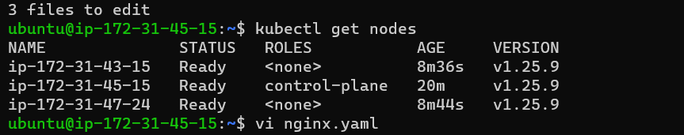

# Create 1 master node and 2 worker nodes – run app on node1 and db on node2 by using

### Create a Kubernetes cluster using kubeadm
#### Install Docker on  ubuntu machines
* curl -fsSL https://get.docker.com -o get-docker.sh
* sh get-docker.sh
* sudo usermod -aG docker ubuntu
* exit
* re-login
This url used for refernce steps
[RefereHere](https://github.com/Mirantis/cri-dockerd)
# Run these commands as root user
* ###Install GO###
* sudo -i
* wget https://storage.googleapis.com/golang/getgo/installer_linux
* chmod +x ./installer_linux
* ./installer_linux
* source ~/.bash_profile
* git clone https://github.com/Mirantis/cri-dockerd.git
* cd cri-dockerd
* mkdir bin
* go build -o bin/cri-dockerd
* mkdir -p /usr/local/bin
* install -o root -g root -m 0755 bin/cri-dockerd /usr/local/bin/cri-dockerd
* cp -a packaging/systemd/* /etc/systemd/system
* sed -i -e 's,/usr/bin/cri-dockerd,/usr/local/bin/cri-dockerd,' /etc/systemd/system/cri-docker.service
* systemctl daemon-reload
* systemctl enable cri-docker.service
* systemctl enable --now cri-docker.socket
* cd ~
* sudo apt-get update
* sudo apt-get install -y apt-transport-https ca-certificates curl
* sudo curl -fsSLo /etc/apt/keyrings/kubernetes-archive-keyring.gpg https://packages.cloud.google.com/apt/doc/apt-key.gpg
* echo "deb [signed-by=/etc/apt/keyrings/kubernetes-archive-keyring.gpg] https://apt.kubernetes.io/ kubernetes-xenial main" | sudo tee /etc/apt/sources.list.d/kubernetes.list
* sudo apt-get update
* sudo apt-get install -y kubelet kubeadm kubectl
* sudo apt-mark hold kubelet kubeadm kubectl
    ## these above steps all are used in Master , Node1, Node2
   ### use these command only in master
* kubeadm init --pod-network-cidr "10.244.0.0/16" --cri-socket "unix:///var/run/cri-dockerd.sock"
* exit
[RefereHere](https://kubernetes.io/docs/setup/production-environment/tools/kubeadm/create-cluster-kubeadm/)
* mkdir -p $HOME/.kube
* sudo cp -i /etc/kubernetes/admin.conf $HOME/.kube/config
* sudo chown $(id -u):$(id -g) $HOME/.kube/config
* kubectl apply -f https://github.com/flannel-io/flannel/releases/latest/download/kube-flannel.yml
* kubectl get nodes

### use these commands in Node1, Node2 ( as a root user)
kubeadm join 172.31.36.73:6443 --token paqndf.xvzsuv4f7mctr3xs \
       --cri-socket "unix:///var/run/cri-dockerd.sock" \
        --discovery-token-ca-cert-hash sha256:b29c8db59af2357007431c22bc3c776a908618d7fb64cbafd533db70023f06de
`above steps taken in master node successfully installation part`

## Node selector

* First we need to se the label for the node:
  ``kubectl label nodes <your-node-name> disktype=ssd``
  ``kubectl label nodes  ip-172-31-47-231 app=nginx``

```yaml
---
apiVersion: apps/v1
kind: Deployment
metadata:
  name: nginx
  labels:
    app: nginx
spec:
  minReadySeconds: 1
  replicas: 2
  selector:
    matchLabels:
      app: nginx
  template:
    metadata:
      name: nginx
      labels:
        app: nginx
    spec:
      nodeSelector: 
        app: nginx
      containers:
        - name: nginx
          image: nginx
          ports:
            - containerPort: 80
```

```yaml
---
apiVersion: v1
kind: Pod
metadata:
  name: mysql
spec:
  nodeSelector:
    app: mysql
  containers:
    - name: mysql
      image: mysql:8
      env:
        - name: MYSQL_ROOT_PASSWORD
          value: Gshravani@143
        - name: MYSQL_DATABASE
          value: employees
        - name: MYSQL_USER
          value: shravani
        - name: MYSQL_PASSWORD
          value: Gshravani@143
      ports:
        - containerPort: 3306
```


# Affinity
* First we need to se the label for the node:
  ``kubectl label nodes <your-node-name> disktype=ssd``
  ``kubectl label nodes  ip-172-31-47-231 app=mysql``
```yaml
---
apiVersion: v1
kind: Pod
metadata:
  name: mysql
spec:
  affinity:
    nodeAffinity:
      requiredDuringSchedulingIgnoredDuringExecution:
        nodeSelectorTerms:
          - matchExpressions:
              - key: app
              - values: mysql
  containers:
    - name: mysql
      image: mysql:8
      env:
        - name: MYSQL_ROOT_PASSWORD
          value: Gshravani@143
        - name: MYSQL_DATABASE
          value: employees
        - name: MYSQL_USER
          value: shravani
        - name: MYSQL_PASSWORD
          value: Gshravani@143
      ports:
        - containerPort: 3306
```
 ``kubectl label nodes  ip-172-31-43-251 app=nginx``
```yaml
---
apiVersion: apps/v1
kind: Pod
metadata:
  name: nginx
  labels:
    app: nginx
spec:
  affinity:
    nodeAffinity:
      requiredDuringSchedulingIgnoredDuringExecution:
        nodeSelectorTerms:
          - matchExpressions:
              - key: app
              - values: nginx
  containers:
    - name: nginx
      image: nginx
    ports:
      - containerPort: 80
   

```


# Taints and tolerances
```yaml
---
apiVersion: v1
kind: Pod
metadata:
  name: mysql
spec:
  tolerations:
    - key: app
      value: mysql
      operator: Exists
  containers:
    - name: mysql
      image: mysql:8
      env:
        - name: MYSQL_ROOT_PASSWORD
          value: Gshravani@143
        - name: MYSQL_DATABASE
          value: employees
        - name: MYSQL_USER
          value: shravani
        - name: MYSQL_PASSWORD
          value: Gshravani@143
      ports:
        - containerPort: 3306
```
```yaml
---
apiVersion: apps/v1
kind: Pod
metadata:
  name: nginx
  labels:
    app: nginx
spec:
  tolerations:
    - key: app
      value: nginx
      operator: Exists
  containers:
    - name: nginx
      image: nginx
    ports:
      - containerPort: 80
```
# Taints
This means that no pod will be able to schedule onto given node. 
``kubectl taint nodes ip-172-31-43-251 key1=value1:NoSchedule``

This means that pod will be able to schedule onto given node.
 
``kubectl taint nodes ip-172-31-43-251 app=mysql:NoSchedule-``

# Create k8s cluster with version 1.25 and run any deployment(nginx/any) and then upgrade cluster to version 1.27

Install kuberbetes 1.25 version by using below commands:

#### Install Docker on  ubuntu machines
* curl -fsSL https://get.docker.com -o get-docker.sh
* sh get-docker.sh
* sudo usermod -aG docker ubuntu
* exit
* re-login
This url used for refernce steps


```sh
#!/bin/bash
wget https://storage.googleapis.com/golang/getgo/installer_linux
chmod +x ./installer_linux
./installer_linux
source ~/.bash_profile
git clone https://github.com/Mirantis/cri-dockerd.git
cd cri-dockerd
mkdir bin
go build -o bin/cri-dockerd
mkdir -p /usr/local/bin
install -o root -g root -m 0755 bin/cri-dockerd /usr/local/bin/cri-dockerd
cp -a packaging/systemd/* /etc/systemd/system
sed -i -e 's,/usr/bin/cri-dockerd,/usr/local/bin/cri-dockerd,' /etc/systemd/system/cri-docker.service
systemctl daemon-reload
systemctl enable cri-docker.service
systemctl enable --now cri-docker.socket
cd ~
sudo apt-get update
sudo apt-get install -y apt-transport-https ca-certificates curl
sudo curl -fsSLo /etc/apt/keyrings/kubernetes-archive-keyring.gpg https://packages.cloud.google.com/apt/doc/apt-key.gpg
echo "deb [signed-by=/etc/apt/keyrings/kubernetes-archive-keyring.gpg] https://apt.kubernetes.io/ kubernetes-xenial main" | sudo tee /etc/apt/sources.list.d/kubernetes.list
sudo apt-get update
sudo apt-get install -y kubelet=1.25.9-00 kubeadm=1.25.9-00 kubectl=1.25.9-00
sudo apt-mark hold kubelet kubeadm kubectl
```


## these above steps all are used in Master , Node1, Node2
   ### use these command only in master
* kubeadm init --pod-network-cidr "10.244.0.0/16" --cri-socket "unix:///var/run/cri-dockerd.sock"
* exit
[RefereHere](https://kubernetes.io/docs/setup/production-environment/tools/kubeadm/create-cluster-kubeadm/)
* mkdir -p $HOME/.kube
* sudo cp -i /etc/kubernetes/admin.conf $HOME/.kube/config
* sudo chown $(id -u):$(id -g) $HOME/.kube/config
* kubectl apply -f https://github.com/flannel-io/flannel/releases/latest/download/kube-flannel.yml
* kubectl get nodes
* kubeadm join 172.31.45.15:6443 --token 6h0v7c.cnjcgb5ax2czhkd7 \
       --cri-socket "unix:///var/run/cri-dockerd.sock"
        --discovery-token-ca-cert-hash sha256:b5510c59d3783393ea6e8e9254b9470e5c82ad07de55379ad6d69c36e2d2f2d5





Ruunig mysql on one node and nginx on another node by using manifest files:
```yaml
---
apiVersion: v1
kind: Pod
metadata:
  name: mysql
spec:
  tolerations:
    - key: app
      value: mysql
      operator: Exists
  containers:
    - name: mysql
      image: mysql:8
      env:
        - name: MYSQL_ROOT_PASSWORD
          value: Gshravani@143
        - name: MYSQL_DATABASE
          value: employees
        - name: MYSQL_USER
          value: shravani
        - name: MYSQL_PASSWORD
          value: Gshravani@143
      ports:
        - containerPort: 3306
```
```yaml
---
apiVersion: apps/v1
kind: Deployment
metadata:
  name: nginx
  labels:
    app: nginx
spec:
  minReadySeconds: 1
  replicas: 2
  selector:
    matchLabels:
      app: nginx
  template:
    metadata:
      name: nginx
      labels:
        app: nginx
    spec:
      nodeSelector: 
        app: nginx
      containers:
        - name: nginx
          image: nginx
          ports:
            - containerPort: 80
```
* After installing the k8s I have created mysql pod in one node and nopcommerce pod in one node by using manifest files
``Kubectl apply -f nginx.yaml``


* Nodes are in 1.25.9 version. Let's upgrade to 1.26.0 version by following beloe steps
```
apt update
apt-cache madison kubeadm
kubeadm upgrade plan
apt-mark unhold kubeadm 
apt-get update 
apt-get install -y kubeadm=1.26.0-00 
apt-mark hold kubeadm
kubeadm version
kubectl drain ip-172-31-45-15 --ignore-daemonsets --delete-local-data
kubeadm upgrade apply v1.26.0
kubectl uncordon ip-172-31-45-15

```


```
apt-mark unhold kubelet kubectl 
apt-get update 
apt-get install -y kubelet=1.26.0-00 kubectl=1.26.0-00
apt-mark hold kubelet kubectl
```


Check the Version of the worker node From master machine
``Kubectl get nodes``
* Upgrade kubeadm perform this on Worker Machine

```
apt-mark unhold kubeadm && \
apt-get update && apt-get install -y kubeadm=1.26.0-00 && \
apt-mark hold kubeadm
```

* Drain the Worker Node (perform this on master Machine)

``kubectl drain ip-172-31-43-15 --ignore-daemonsets``
``kubectl drain ip-172-31-47-24 --ignore-daemonsets``

* Upgrade kubelet config on worker node (perform this on Worker Machine)

* Install the version which we want to upgrade
```
kubeadm upgrade node
apt-mark unhold kubelet kubectl && \
apt-get update && apt-get install -y kubelet=1.26.0-00 kubectl=1.26.0-00 && \
apt-mark hold kubelet kubectl
```
* Restart the kubelet
```
systemctl daemon-reload
systemctl restart kubelet
```

* Uncordon the node (perform this on master Machine)

``kubectl uncordon ip-172-31-43-15 ``
``kubectl uncordon ip-172-31-47-24``
``kubectl get nodes``

 # Version changed to 1.25.0 to 1.26.0

 ## Now version changes to 1.26.0 to 1.27.0 by following the above steps
 * Control plane is upgraded  1.27

* Worker nodes are upgraded to 1.27


